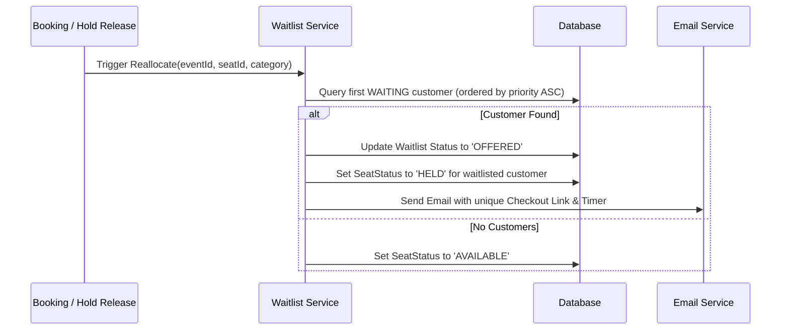

# Ticket Booking System - System Design Document

This document outlines the system architecture, concurrency protection, and waitlist management mechanisms implemented in the Ticket Booking System.

---

## 1. Seat Hold and TTL Mechanism
When a customer selects seats and proceeds to checkout, the system secures them by changing their status to `HELD` in the `SeatStatus` table, assigning the customer's `userId`, recording the hold timestamp (`heldAt`), and computing an expiration timestamp (`expiresAt` = `heldAt` + TTL, typically 10 minutes). 

### Auto-Release Scheduler
An in-memory background worker (running every 10 seconds via `setInterval`) sweeps the database for expired holds:
1. It queries `SeatStatus` records where `status = 'HELD'` and `expiresAt < NOW()`.
2. For each expired record, it reverts the status to `AVAILABLE` and clears user/hold associations within a database transaction.
3. Once a seat is freed, the scheduler triggers the waitlist reallocation service to immediately check if any customers are queued for that seat's category.

---

## 2. Concurrency Prevention
To prevent race conditions where two customers attempt to hold or book the same seat simultaneously, the system enforces **strict serialization** of seat updates:

### Database Locking Strategy
1. **Prisma Transactions**: All seat status transitions (from `AVAILABLE` to `HELD`, and `HELD` to `BOOKED`) are wrapped inside a database transaction (`prisma.$transaction`).
2. **SQLite / PostgreSQL Write Locks**: 
   - Under SQLite, Prisma writes are serialized via database-wide locks, ensuring that only one transaction can modify seat statuses at a time.
   - For PostgreSQL in production, the transaction utilizes row-level locking or optimistic update filtering:
     ```sql
     UPDATE SeatStatus 
     SET status = 'HELD', heldByUserId = :userId, heldAt = :now, expiresAt = :expiresAt
     WHERE seatId = :seatId AND eventId = :eventId AND (status = 'AVAILABLE' OR (status = 'HELD' AND expiresAt < :now))
     ```
3. **Atomic Verifications**: Before applying updates, the transaction fetches current statuses and validates that every requested seat is either `AVAILABLE` or has an expired hold. If even one seat fails validation, the entire transaction rolls back, throwing a validation error to the concurrent request.

---

## 3. Waitlist Auto-Assignment Flow
When a high-demand event sells out (i.e. zero available seats remain in a category), customers can join the `Waitlist` queue for that specific seat category.



### Auto-Reallocation Trigger
Reallocation occurs automatically on two events:
- **Booking Cancellation**: When a customer cancels a confirmed booking, the associated seats are freed.
- **Hold Expiration**: When a customer's seat hold expires or a waitlist offer expires.

The service queries the `Waitlist` table for the oldest record with `status = 'WAITING'` for the matching event and seat category. If found, it promotes the customer's waitlist status to `OFFERED`, sets an `offerExpiresAt` timestamp, and locks the seat under their name (`heldByUserId` = waitlist customer's ID).

---

## 4. Time-Limited Offer Handling
Waitlist offers are time-bound to prevent a single unresponsive customer from blocking tickets indefinitely.

### Expiry and Escalation
- **Offer TTL**: Each waitlist offer is valid for 10 minutes from `offeredAt`.
- **Background Checks**: The scheduler identifies waitlist entries with `status = 'OFFERED'` and `offerExpiresAt < NOW()`.
- **Escalation**:
  1. The expired waitlist entry is marked as `EXPIRED`.
  2. The hold on the offered seat is released.
  3. The reallocation workflow is triggered again for this specific seat, instantly promoting the next customer in the waitlist queue and sending them an invitation email.
- **Completion**: If the customer completes the booking within the 10-minute window, their waitlist status is marked as `COMPLETED`, and the seat status transitions permanently to `BOOKED`.
